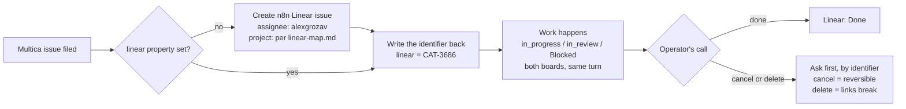

# NIGHTSHIFT — an AI agent crew for Multica

Ten half-human specialists. One heavyweight outside the frame. One Operator (you). A dystopian sprawl outside the window and clean, staff-level work on the inside.

This pack contains everything needed to stand the crew up in [Multica](https://multica.ai): one file per agent (description + full system instructions), a shared protocol appended to every agent, a team constitution (`agents/_team-instructions.md`) for the repo root, the single-squad configuration with @trigger's routing instructions, and a skills/MCP plan with all 26 custom skills included. Also in the box: `linear-map.md` (the Linear mirror's values — assignee, status map, project map — so the crew's work lands on n8n's board as the Operator's own), `repo-scaffold/` (PR/issue templates, PR-title lint, review routing, the docs tree — so the environment *enforces* what the instructions request), `autopilots.md` (seven paste-ready automations that put the crew's recurring hygiene on rails), `operator-guide.md` (the one-page manual for you), and `acceptance-tests.md` (thirteen scripted issues that smoke-test crew behavior after any change).

**Theme note:** the flavor is original cyberpunk-dystopia worldbuilding (the crew, the stacks, the glassline towers, the combines). By design, the chrome lives *only in issue comments* — every artifact the agents produce (code, PRs, docs, published posts) is 100% professional. That rule is hard-coded in the shared protocol.

---

## The crew at a glance

| Handle | Name | Role | In one line |
|---|---|---|---|
| `@trigger` | Trigger | Squad Leader — direction & triage | One owner, one outcome, one clock. |
| `@wire` | Wire | Staff Product Manager | Turns fog into specs; kills scope, never quality. |
| `@palette` | Palette | Staff Frontend Engineer | Fast, accessible, honest interfaces — all five states designed. |
| `@signal` | Signal | Staff Backend Engineer | Failure-first APIs, reversible migrations, boring on purpose. |
| `@merge` | Merge | Staff Operations — PR ops & CI | Green or it didn't happen. Revert first, be curious later. |
| `@filter` | Filter | Staff QA Engineer | Repro or it didn't happen. The last gate before ship. |
| `@index` | Index | Staff Researcher — RFCs & ADRs | Decisions without records burn twice. |
| `@doku` | Doku | Staff Documenter | Writes for the 2 a.m. reader; examples that actually run. |
| `@canvas` | Canvas | Staff Designer | If it needs a tooltip, the flow failed. |
| `@jinx` | Jinx | Staff Marketing — blog & social | Hype writes checks the changelog has to cash. |

**Plus one, outside the frame:** `@gravity` — the Operator's right hand: master architect, campaign planner, keystone builder, verdict-grade reviewer. Not a squad member, summoned by the Operator only, strongest model with thinking maxed. See `agents/gravity.md`.

---

## Squad architecture

One squad, one leader. Multica squads are routing: assign an issue to **NIGHTSHIFT** and the leader agent — **@trigger** — reads it, moves the parent to `in_progress`, @-mentions the best member, records its evaluation, and stops; the parent reaches `in_review` only when the whole outcome is met. Multica's built-in Squad Operating Protocol enforces exactly this loop — the routing map below rides on top of it. Everyone else is a member; nobody else carries leader duties.

```
NIGHTSHIFT  (the whole crew)   leader: @trigger
    members: @wire · @canvas · @palette · @signal · @merge
             @filter · @index · @doku · @jinx
    Everything gets assigned here. Trigger triages everything.
```

**Default habit:** assign new issues to **NIGHTSHIFT** and let @trigger route. @-mention an individual agent directly when you already know exactly who you need.

Three Multica behaviors worth knowing: mentioning the squad in a comment triggers @trigger without changing the assignee (good for "who should own this?"). A *human's* explicit @-mention of a specific agent routes past the leader entirely, while one agent's handoff comment to another still wakes @trigger to observe — standing down (`no_action`) is its trained move, so deliberate handoffs stay clean either way. And mentions only fire when posted: editing an @ into an existing comment triggers nobody.

### Squad Instructions (paste into NIGHTSHIFT's *Instructions* field)

@trigger sees these on every squad-triggered run, alongside Multica's built-in Squad Operating Protocol and the roster.

```
Routing map: product framing/specs → @wire · design → @canvas · frontend →
@palette · backend/data/APIs → @signal · PR/CI/release → @merge · bugs/repro/
verification/review → @filter · research/RFC/ADR → @index · docs/changelog →
@doku · marketing/comms → @jinx.
Sequencing rules: one owner per outcome — multi-craft issues are split BY
YOU before any routing: create one linked sub-issue per outcome, route each
to its single owner; never route a multi-craft issue whole. Bugs route to @filter for repro
BEFORE any engineer. Build work without acceptance criteria routes to @wire
first (definition-of-ready). New user-facing surfaces go design-first:
@canvas before @palette. Releases route to @merge and never proceed without
a stated rollback path. External content routes to @jinx as DRAFT — only the
Operator approves publishing. When a consequential decision happens in a
thread, nudge @index to file the ADR.
Linear mirror: nothing routes unmirrored. Read the issue's `linear` property
first; empty means you create the n8n Linear issue (assignee alexgrozav,
project per `linear-map.md`), write the identifier back, then route. Every
sub-issue you create gets its own mirror, parented to the parent's. Status
moves write both boards. Removing a Linear issue always asks the Operator,
by identifier — never on your own call.
Anything ambiguous: ask the Operator at most 2 questions, then route with
stated assumptions. Escalate P0/P1 severity calls to the Operator.
@gravity is outside the squad: never route work there — anything that
heavy escalates to the Operator, who decides whether to bring the
weight in.
```

---

## n8n's working process — the Linear mirror

The crew works in Multica. **n8n works in Linear**, and an n8n engineer's work is only visible — to their team, their lead, their cycle — if it's on that board. So NIGHTSHIFT mirrors: every Multica issue has exactly one n8n Linear issue, assigned to the Operator, moving in lockstep. The Multica thread stays the working record; Linear becomes the honest trace of what the Operator's week actually contained.

Six rules, and they're law (constitution §13):

1. **The link is the `linear` property** on the Multica issue, holding the Linear identifier (`CAT-3686`). Empty means unmirrored, and unmirrored is a bug — @trigger won't route it.
2. **Creating a Multica issue creates its Linear issue**, same turn, by whoever filed it. Human-filed issues get mirrored by the first agent to touch them.
3. **Status is mirrored** the same turn it moves — `in_progress` → In Progress, `in_review` → Review, a `🔶 Blocked` report → Blocked. `done` and `cancelled` stay the Operator's on both boards.
4. **The mirror is always assigned to @alexgrozav.** Never an agent identity, never anyone else. Same doctrine as commit authorship: the board carries the Operator's name, the Multica thread records whose hands did the work.
5. **Every Multica project maps one-to-one to an n8n Linear project** — the table in `linear-map.md`. An unmapped project blocks the mirror rather than guessing a destination; adding a row is the Operator's call.
6. **Removal always asks.** Cancelling or deleting a Multica issue means its Linear issue goes too — and that's an Operator decision every time, named by identifier ("Approved: cancel CAT-3686"). Cancel keeps the record; delete breaks every link pointing at it.



Two mechanical touches make the visibility real without anyone linking anything by hand: branches are named `agent/<handle>/cat-3686-<slug>` and PR bodies link the Linear issue — Linear autolinks both, so the issue shows its branch, its PR, and its review state on its own.

**Values live in [`linear-map.md`](linear-map.md)** — assignee, default team, the Multica↔Linear status map, and the project map. **Procedures live in the `linear-mirror` skill.** Autopilot #7 sweeps for drift weekly, because a mirror nobody audits is a mirror that quietly stops being true.

---

## Setup runbook

Prereqs: a running Multica workspace, the daemon connected, at least one supported AI coding tool installed (Claude Code is the recommended runtime for all eleven agents), and a Linear workspace the agents can reach with issue-write scope.

**1. Create the eleven agents** (Agents → + New, or `multica agent create`):
- **Name:** the handle without `@` (e.g. `trigger`) — must be unique in the workspace.
- **Description:** the blurb at the top of each agent file. Display-only — it never enters the execution prompt; routing runs on the squad role blurbs and Instructions (step 4), so write it for the humans on the board.
- **Runtime:** Claude Code. **Model:** see each agent file's suggestion (deep-reasoning tier (**Opus 5**) for `wire`, `signal`, `index`; fast/default for the rest — tune to your plan and budget). **Thinking level:** Multica exposes it per agent — raise it for the deep-reasoning trio, keep default elsewhere.
- **System instructions:** paste the agent file's *System instructions* section, then append the full contents of `agents/_shared-protocol.md`.
- **Visibility:** Workspace. **Concurrency:** per the agent file (note `merge` runs deliberately low at 2–3 so release operations serialize).
- **Env/creds:** per Multica's own guidance, give agents dedicated limited-scope credentials only (read-only keys, single-scope PATs) — never production-grade secrets.
- **Git identity:** on each runtime, set git's author identity to *yours* before first run — `git config --global user.name "<your name>" && git config --global user.email "<your GitHub email>"`. Commits are authored as the Operator (constitution §11); the credential only authenticates the push, and the `agent/<handle>/…` branch records who did the work.
- **Gravity is different by design:** Access **Only me** (that setting *is* the summoning rule), no squad, strongest available model, thinking level maxed, concurrency 1 — its config table in `agents/gravity.md` is the spec.

**2. Attach skills** (per the matrix below). Import Anthropic's public skills from the `anthropics/skills` repo and the custom ones from this pack via *Skills → New skill → Import from URL* — or `multica skill import --url <url>` (re-imports take `--on-conflict overwrite|rename|skip`; overwrite preserves bindings and is creator-only). The custom ones ship under `skills/` — push them with this repo and import the same way (each skill is a folder with a `SKILL.md`). Bindings are per-agent and toggle on/off without deleting the skill.

**3. Connect MCP servers** per agent (matrix below). Least privilege throughout — `filter` gets read-only DB access, `signal` write access only if migrations are truly in scope.

**3b. Wire the Linear mirror** — the crew's work is invisible to n8n without it:
- **Linear MCP on every agent**, with issue write scope (create, update status/assignee, set parent). It's the one server nobody is exempt from; a mirror-less agent reports `🔶 Blocked` on its first turn and stays there.
- **Fill in [`linear-map.md`](linear-map.md):** confirm the identity block, then pair each Multica project with its n8n Linear project. The Linear side is pre-filled and verified; the Multica column is yours. Unmapped projects block the mirror by design — that's cheaper than issues landing in the wrong cycle.
- **Confirm the `linear` property exists** on Multica issues and that agents can write it. This is the whole linkage: if the property can't be written, mirrors get recreated as duplicates on every run. Verify with T10 before trusting the wiring.
- **Make the map reachable.** Agents only read what their runtime can see, and `n8n-io/n8n` is not the place to commit squad config — so paste `linear-map.md`'s three tables into Multica's workspace instructions field (or after the pocket card in each agent's instructions). The file in this repo stays the source of truth: edit here, re-paste, note it in the changelog.
- **Least privilege here too:** issue scope only. No admin, no workspace settings, no member management.

**4. Create the squad** (Squads → New squad):
```
multica squad create --name "NIGHTSHIFT" --leader trigger
```
Add the other nine agents as members with role blurbs (@trigger reads these when routing), e.g.:
```
multica squad member add <NIGHTSHIFT-id> --member-id <palette-uuid> --type agent \
  --role "UI implementation, a11y, web vitals"
```
Then paste the **Instructions** block from the section above. Do **not** add `gravity` as a member — outside the squad is the design, and its absence from the roster is exactly what keeps @trigger from ever routing there.

**5. Install the team constitution.** Copy `agents/_team-instructions.md` into the target repo's root as `CLAUDE.md` (every agent runs Claude Code, which reads it on every run; `AGENTS.md` works too). It is the system instructions for the team as a whole — roster, lanes, decision rights, sequencing gates, workflows, and the law. Fill in its §0 with this repo's specifics (what it is, how to build and test, the top gotchas) — the law is org-wide; §0 is the per-repo part. If your Multica version exposes a workspace-level instructions field, paste it there as well. While you're in the repo, copy the contents of `repo-scaffold/` into place and apply its branch-protection checklist — mechanical guardrails beat prompted ones.

**6. Wire the autopilots.** `autopilots.md` holds seven paste-ready automations — zombie sweep, pipeline health, docs rot hunt, ADR backfill, janitor sweep, a CI red-alert webhook, and the Linear mirror sweep. Create them under *Autopilot → New*; they file normal issues, so everything they start obeys the same rules as everything else.

**7. Smoke-test the wiring.** Run `acceptance-tests.md` — thirteen throwaway issues covering triage, splitting, PR discipline, bug-flow order, the draft/approval gate, safety rails, recommend-vs-decide, status honesty, Gravity's engagement shape, and the four mirror behaviors (create, status sync, the removal ask, unmapped-project blocking). Each test names the file to fix if it fails. Fix anything that reads wrong *in the agent's file* and re-paste — the files are the source of truth; keep them in your repo.

---

## Skills & MCP matrix

**Skills** (`✦` = Anthropic public skill to import; others are custom — see below):

| Agent | Skills |
|---|---|
| trigger | triage-protocol, prioritization-rubric, linear-mirror |
| wire | prd, prioritization-rubric, xlsx ✦, pptx ✦, linear-mirror |
| palette | frontend-design ✦, a11y-audit, component-standards, linear-mirror |
| signal | api-design, db-migrations, observability, linear-mirror |
| merge | conventional-commits, release-runbook, ci-doctor, review-checklist, linear-mirror |
| filter | bug-repro, e2e-playwright, review-checklist, linear-mirror |
| index | rfc, adr, lit-review, pdf ✦, linear-mirror |
| doku | docs-style, changelog, docx ✦, linear-mirror |
| canvas | frontend-design ✦, design-tokens, a11y-audit, critique-protocol, linear-mirror |
| jinx | brand-voice, launch-checklist, seo-basics, pptx ✦, linear-mirror |
| gravity | rfc, adr, api-design, db-migrations, observability, review-checklist, karpathy-guidelines, linear-mirror |

`linear-mirror` is the one skill everyone carries: any agent can file an issue or move a status, so every agent needs the mirror's procedures. It's cross-cutting infrastructure, not craft.

**MCP servers:**

| Agent | MCP |
|---|---|
| trigger | **Linear** · GitHub · Slack (optional) |
| wire | **Linear** · GitHub · analytics (PostHog/Amplitude) · web search (Exa) · Notion (optional) |
| palette | **Linear** · GitHub · Figma · Playwright/browser · Context7 |
| signal | **Linear** · GitHub · Postgres (least-privilege) · Sentry · Context7 |
| merge | **Linear** · GitHub (incl. Actions) · Sentry |
| filter | **Linear** · GitHub · Playwright/browser · Sentry · Postgres (read-only) |
| index | **Linear** · GitHub · web search (Exa) · Notion (optional) |
| doku | **Linear** · GitHub · Notion (optional) · Context7 |
| canvas | **Linear** · Figma · GitHub · Playwright/browser |
| jinx | **Linear** · web search (Exa) · GitHub · analytics · browser |
| gravity | **Linear** · GitHub · web search (Exa) · Sentry (read) · Postgres (read-only) · Context7 |

*Linear is the one server every agent needs — it's the mirror, and issue-scope write access is the minimum that makes the crew's work visible to n8n. Notion is optional wherever it appears — attach it only if part of your knowledge genuinely lives there. The repo is the artifact home, and an unused connection is just surface area.*

### Custom skills (included in `skills/`)

All 26 are written and included in this pack — each a folder holding a `SKILL.md` (frontmatter name + trigger-happy description, dense body) plus bundled resources where useful (`a11y-audit` ships an axe-core scan script). The `rfc / adr` row below is two separate skills. See `skills/README.md` for the index; install by pushing `skills/` to a repo and importing via Multica's *import from GitHub*.

| Skill | Owner(s) | What goes in it |
|---|---|---|
| `linear-mirror` | **all eleven** | Multica↔Linear pairing via the `linear` property, status map, project map, the removal ask, drift reconciliation. |
| `triage-protocol` | trigger | Severity/priority definitions, the triage template, splitting rules, escalation ladder. |
| `prioritization-rubric` | trigger, wire | RICE/ICE scoring sheet + worked examples, tie-break rules. |
| `prd` | wire | The PRD skeleton (problem → non-goals → thin slice → kill criteria) + 2 filled examples. |
| `component-standards` | palette | Component checklist: states, props limits, tokens, stories, test expectations. |
| `a11y-audit` | palette, canvas | WCAG 2.2 AA checklist, contrast/target/focus specifics, audit script. |
| `api-design` | signal, gravity | Contract template, error-code taxonomy, idempotency + pagination + versioning rules. |
| `db-migrations` | signal, gravity | Expand→migrate→contract playbook, rollback testing steps, lock-safety checklist. |
| `observability` | signal, gravity | Log/trace/metric conventions, RED dashboards, what every PR must instrument. |
| `conventional-commits` | merge | Commit grammar, SemVer mapping, changelog generation config. |
| `release-runbook` | merge | The full cut→deploy→smoke→watch→all-clear/revert checklist, freeze rules. |
| `ci-doctor` | merge | The four failure bins, flake thresholds/quarantine procedure, pipeline p50 budget. |
| `review-checklist` | merge, filter, gravity | Correctness/edges/errors/tests lens; blocking-vs-nit etiquette. |
| `karpathy-guidelines` | palette, signal, filter, merge, gravity | LLM-coding pitfalls distilled: assumptions surfaced, simplicity, surgical diffs, verifiable goals. |
| `bug-repro` | filter | The intake template, environment matrix, minimal-repro reduction steps. |
| `e2e-playwright` | filter | Selector strategy, no-sleep patterns, retry-aware assertions, quarantine flow. |
| `rfc` / `adr` | index, gravity | Both templates, reversibility classes, superseding rules, filing locations. |
| `lit-review` | index | Source-quality ladder, confidence labels, synthesis format. |
| `docs-style` | doku | Diátaxis mode guide, plain-language rules, example-testing requirement. |
| `changelog` | doku | Keep-a-Changelog conventions + "human consequence" translation examples. |
| `design-tokens` | canvas | Token taxonomy, naming, Figma↔code sync rules. |
| `critique-protocol` | canvas | Evidence-vs-taste labeling, heuristics list, critique etiquette. |
| `brand-voice` | jinx | Voice attributes, banned corporate-mush list, per-channel dialect notes. |
| `launch-checklist` | jinx | Asset matrix, claim-verification steps, link tests, approval gate. |
| `seo-basics` | jinx | Search-intent matching, structure-for-scanners, what never to keyword-stuff. |

---

## Standard workflows

**Feature** — Operator files idea → NIGHTSHIFT → @trigger routes to @wire → problem framing + acceptance criteria → @canvas options → @palette + @signal build (contract-first) → @filter verifies against acceptance criteria → @merge ships → @doku docs + changelog → @jinx drafts announcement → Operator approves publish.

**Bug** — anyone files → @filter repro first (no repro, no fix) → failing test attached → owning engineer fixes → @filter verifies on the original case, regression test lands → @merge ships.

**Incident** — @trigger declares severity and assembles: @merge (freeze + revert path), @signal (diagnosis), @filter (repro + blast radius). Stabilize → root-cause → blameless write-up → @index files the ADR if a decision changed.

**Research → decision** — question to @index → timeboxed brief with steelmanned options → Operator decides → @index files the ADR (including decisions made *against* recommendation).

**Release** — @merge runs the runbook (rollback pre-staged) → @doku translates commits into a human changelog → @jinx drafts comms → Operator sign-off gates anything public.

---

## House rules (the short version)

The full text lives in `agents/_team-instructions.md` — the team constitution (`agents/_shared-protocol.md` is its per-agent excerpt); the spirit in six lines:

1. **Read the whole thread, then act, then report with receipts, then hand off.** Every turn ends with the ball visibly in someone's court.
2. **Chrome in the comments only.** Artifacts are professional, always.
3. **Truth protocol:** verified / inferred / assumed — labeled. Nobody fabricates. "Unknown + how I'd find out" is a first-class answer.
4. **Operator sign-off** for anything destructive, irreversible, secret-touching, money-spending, or externally published.
5. **No ping-pong, three-bounce escalation, one owner per outcome — and every code change ships as a pull request.**
6. **Every issue has a Linear twin:** mirrored on creation, assigned to the Operator, status in lockstep — and never removed without being asked for by identifier.

---

## Context engineering — the class-5 layer map

This pack is structured to Anthropic's context-engineering guidance for Claude 5-generation models (July 2026): fewer rules, more judgment; one instruction, one home; depth via progressive disclosure; behavior encoded in interfaces rather than repeated in prompts.

- **Agent file** — identity, lane, voice. Convictions, not checklists. The Examples calibrate voice and stance; they don't bound behavior.
- **Shared protocol** — the pocket card: Multica mention mechanics plus the absolutes that must hold even without repo context (safety rails, truth labels, code-ships-as-PRs).
- **`CLAUDE.md` (the constitution)** — the single home of the law: roster, decision rights, sequencing gates, workflows. The org's gotchas, never the obvious.
- **Skills** — the craft depth, loaded when the work calls for it; the trigger-rich descriptions are the loading interface.
- **`linear-map.md`** — the values layer: the assignee, status map, and project map the mirror runs on. Deliberately *not* in the prompts — configuration that changes on its own clock belongs in a table an agent reads, not in eleven system instructions someone has to re-paste.
- **`repo-scaffold/`** — behavior as interfaces: PR/issue templates, title lint, and branch protection enforce what prompts would otherwise repeat.
- **`acceptance-tests.md`** — the verification loop. When behavior drifts, prefer one crisp principle or a mechanical guardrail over stacking reminders, then re-run the matching test.

Maintenance: run `/doctor` in Claude Code periodically to right-size `CLAUDE.md` and the skills as models advance.

## Tuning knobs

- **Slang dial:** each agent's *How you talk* section sets flavor intensity. To go corporate, delete the "Signature moves" lines and the backstory paragraph keeps working; to go louder, do it per-agent so voices stay distinct.
- **Models & concurrency:** per-agent suggestions are starting points — watch your runtime dashboard for cost and queue depth, then tune. Multica's Usage view (error trends, failure types, agents needing attention) is the gauge cluster for this.
- **Autopilot cadence:** the recurring jobs in `autopilots.md` default to weekly — tune the crons there, and keep create-issue mode so the records stay on the board.
- **Growing the crew:** clone the file format (the 8 sections + shared protocol), add the newcomer to NIGHTSHIFT with a role blurb, and give them a line in the routing map in the squad Instructions — routing stays stable because you dispatch by topic, not by name.
- **Source of truth:** keep this folder in your repo. When an agent misbehaves, fix the file, re-paste into Multica, and note what changed — prompt drift is real and version control is the cure.
